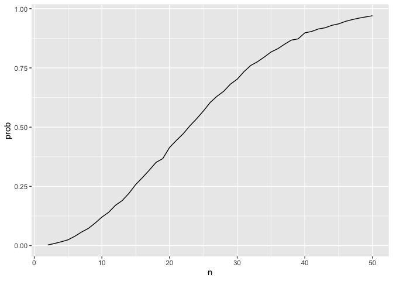
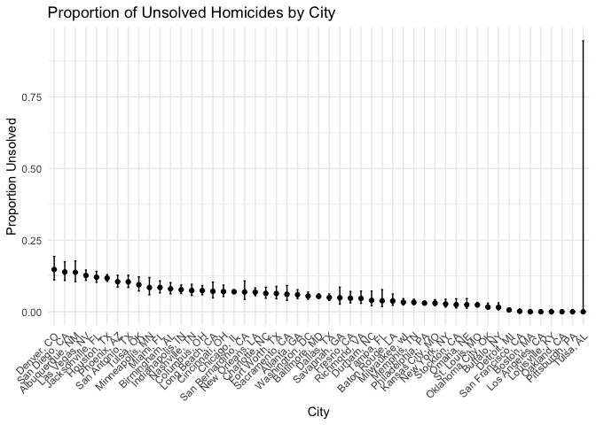

Homework 5
================
Carolyn Martinez
2024-11-12

``` r
library(tidyverse)
```

    ## ── Attaching core tidyverse packages ──────────────────────── tidyverse 2.0.0 ──
    ## ✔ dplyr     1.1.4     ✔ readr     2.1.5
    ## ✔ forcats   1.0.0     ✔ stringr   1.5.1
    ## ✔ ggplot2   3.5.1     ✔ tibble    3.2.1
    ## ✔ lubridate 1.9.3     ✔ tidyr     1.3.1
    ## ✔ purrr     1.0.2     
    ## ── Conflicts ────────────────────────────────────────── tidyverse_conflicts() ──
    ## ✖ dplyr::filter() masks stats::filter()
    ## ✖ dplyr::lag()    masks stats::lag()
    ## ℹ Use the conflicted package (<http://conflicted.r-lib.org/>) to force all conflicts to become errors

``` r
library(ggplot2)
```

## Problem 1: Birthday Function

``` r
bday_sim = function(n) {

  bdays = sample(1:365, size = n, replace = TRUE) 
  
  duplicate = length(unique(bdays)) < n

  return(duplicate)
  
}

sim_res = 
  expand_grid(
    n = 2:50,
    iter = 1:10000
  ) |> 
  mutate(res = map_lgl(n, bday_sim)) |> 
  group_by(n) |> 
  summarize(prob = mean(res)) 

sim_res |> 
  ggplot(aes(x = n, y = prob )) + 
  geom_line()
```

<!-- -->

The results show that the larger the sample size is the higher the
probability of having people share birthdays.

## Problem 2:

``` r
sim_ttest = function(samp_size=30, true_mean, true_sd = 5) {
  
  sim_data = 
    tibble(
      x = rnorm(samp_size, true_mean, true_sd))

  t_test = t.test(sim_data$x)
  
  tidy_result = broom::tidy(t_test)
 
  out_df =
     tibble(
        mu_hat = tidy_result$estimate,
        p_value = tidy_result$p.value)
  
  return(out_df)
}

sim_results = 
     expand_grid(
        true_mean=c(0, 1, 2, 3, 4, 5, 6),
        iter = 1:5000)|> 
   mutate(ttest_res = map(true_mean, ~ sim_ttest(samp_size = 30, true_mean = .x, true_sd = 5))) |> 
   unnest(ttest_res)|>
   mutate(
      conclusion = ifelse(p_value > 0.05,1,0)
   )
```

``` r
power_plotdata=
   sim_results|>
   group_by(true_mean)|>
   mutate(
      prop_mean= mean(p_value<0.05))

power_plot=
   ggplot(power_plotdata, aes(x=true_mean, y = prop_mean))+
   geom_point()+
    labs(
      title = "Power by True mu Value",
      x = "True mu ",
      y = "Proportion of Null Rejected")+
      theme_minimal()

power_plot
```

<!-- --> Based on
the plot above, it is evident that the relationship between the effect
size, the true mu, and the power, or the proportion of the cases where
the null is rejected, is a positive one. As the effect size increases
the power increases, seemingly in an exponential manner.

``` r
sampavg_plotdata=
   sim_results|>
   group_by(true_mean)|>
   mutate(
      avg_mean= mean(mu_hat))

sampavg_plot=
   ggplot(sampavg_plotdata, aes(x=true_mean, y = avg_mean))+
   geom_point()+
    labs(
      title = "Avg mu v. True mu",
      x = "True mu ",
      y = "Average mu Value")+
      theme_minimal()

sampavg_plot
```

<!-- -->

``` r
sampavg_plotdata2=
   sim_results|>
   filter(p_value<0.05)|>
   group_by(true_mean)|>
   mutate(
      avg_mean= mean(mu_hat))

sampavg_plot2=
   ggplot(sampavg_plotdata2, aes(x=true_mean, y = avg_mean))+
   geom_point()+
    labs(
      title = "Avg mu v. True mu (Null Rejected)",
      x = "True mu ",
      y = "Average mu Value")+
      theme_minimal()

sampavg_plot2
```

<!-- -->

Based on the plot above, it is evident that the sample average of mu
across tests for which the null is rejected is not approximately equal
to the true mu value. This is because as the mu value deviates further
from the null value the power increases and therefore more likely to
reject the null hypothesis across samples.

## Problem 3: Homocide Data

``` r
homicide_data=
   read_csv("./homicide-data.csv",na = c("NA", ".", ""))|>
   mutate(
      city_state = paste(city, state, sep = ", ")
   )
```

    ## Rows: 52179 Columns: 12
    ## ── Column specification ────────────────────────────────────────────────────────
    ## Delimiter: ","
    ## chr (9): uid, victim_last, victim_first, victim_race, victim_age, victim_sex...
    ## dbl (3): reported_date, lat, lon
    ## 
    ## ℹ Use `spec()` to retrieve the full column specification for this data.
    ## ℹ Specify the column types or set `show_col_types = FALSE` to quiet this message.

The raw data has 52179 homicides documented with 13 variables including
the date the homicide was reported, the victims first and last name,
their race, age and sex, the city and state of the crime as well as the
latitude and the longitude where the crime occurred and the disposition
of the case.

``` r
summary_table=
   homicide_data|>
   group_by(city_state)|>
  summarize(
    total_homicides = n(),
    unsolved_homicides = sum(disposition %in% c("Closed without arrest" , "Open/no arrest"))
  )
```

``` r
baltimore_prop = function(city_state, disposition) {
 
   baltimore=
   homicide_data|>
   filter(city_state=="Baltimore, MD")
   
   unsolved = sum(baltimore$disposition %in% c("Closed without arrest" , "Open/no arrest"))
  total_count = nrow(baltimore)
  
 prop_test = prop.test(x=unsolved, n = total_count)
 
 tidy_out= broom::tidy(prop_test) 
 
  out_df =
     tibble( 
        conf_low = tidy_out$conf.low,              
        conf_high = tidy_out$conf.high,             
        sample_estimate = tidy_out$estimate)
  
  return(out_df)
}
```

``` r
cities_prop = function(city_state, homicide_data) {
 
cities_data=
   homicide_data|>
   filter(city_state == !!city_state)

unsolved_all = 
   sum(cities_data$disposition %in% c("Closed without arrest" , "Open/no arrest"))

total_count_all = nrow(cities_data)
  
 prop_test_all = prop.test(x=unsolved_all, n = total_count_all)
 
 tidy_out_all= broom::tidy(prop_test_all) 
 
  out_df_all =
     tibble( 
        conf_low = tidy_out_all$conf.low,              
        conf_high = tidy_out_all$conf.high,             
        sample_estimate = tidy_out_all$estimate)|>
         mutate(
            ci = paste(conf_low, conf_high, sep = ", "))

  return(out_df_all)
}

final_results = 
   homicide_data |> 
distinct(city_state) |>  
  mutate(proportionCI = map(city_state, ~ cities_prop(.x, homicide_data))) |>  
  unnest(proportionCI)|>
  mutate(city_state = forcats::fct_reorder(city_state, -sample_estimate))
```

    ## Warning: There was 1 warning in `mutate()`.
    ## ℹ In argument: `proportionCI = map(city_state, ~cities_prop(.x,
    ##   homicide_data))`.
    ## Caused by warning in `prop.test()`:
    ## ! Chi-squared approximation may be incorrect

``` r
final_results
```

    ## # A tibble: 51 × 5
    ##    city_state      conf_low conf_high sample_estimate ci                        
    ##    <fct>              <dbl>     <dbl>           <dbl> <chr>                     
    ##  1 Albuquerque, NM  0.105     0.177            0.138  0.10530080373043, 0.17739…
    ##  2 Atlanta, GA      0.0459    0.0769           0.0596 0.045940933343347, 0.0768…
    ##  3 Baltimore, MD    0.0459    0.0629           0.0538 0.0458779828113626, 0.062…
    ##  4 Baton Rouge, LA  0.0225    0.0618           0.0377 0.0224544641838181, 0.061…
    ##  5 Birmingham, AL   0.0626    0.102            0.08   0.0625900337053163, 0.101…
    ##  6 Boston, MA       0         0.00775          0      0, 0.00775106363845387    
    ##  7 Buffalo, NY      0.00716   0.0313           0.0154 0.00715707945226999, 0.03…
    ##  8 Charlotte, NC    0.0474    0.0857           0.0640 0.0474251307407314, 0.085…
    ##  9 Chicago, IL      0.0634    0.0770           0.0699 0.0634083273304678, 0.077…
    ## 10 Cincinnati, OH   0.0532    0.0929           0.0706 0.053188812448726, 0.0929…
    ## # ℹ 41 more rows

``` r
proportion_plots=
   ggplot(final_results, aes(x=city_state, y= sample_estimate))+
   geom_point()+
   geom_errorbar(aes(ymin=conf_low, ymax=conf_high), width=.2,
                 position=position_dodge(0.05))+
    labs(
      title = "Proportion of Unsolved Homicides by City",
      x = "City",
      y = "Proportion Unsolved")+
      theme_minimal()+
      theme(axis.text.x = element_text(angle = 45, hjust = 1))

proportion_plots
```

<!-- -->
